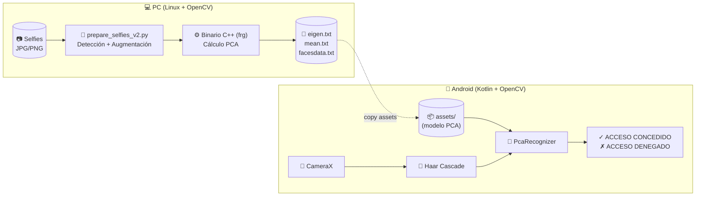
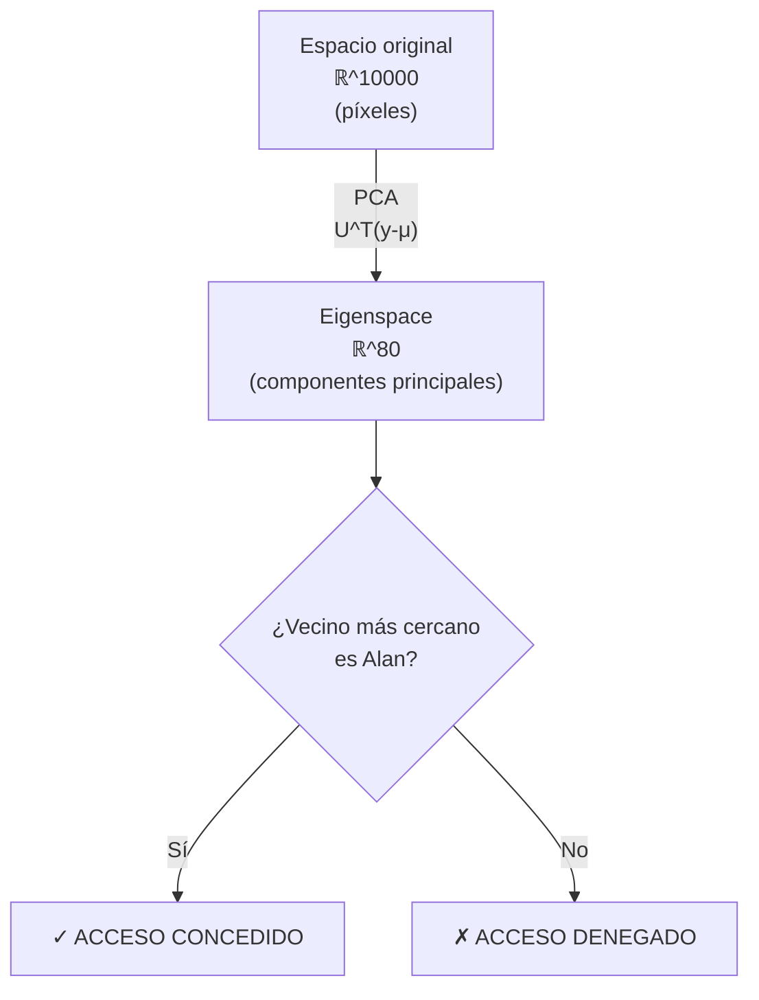
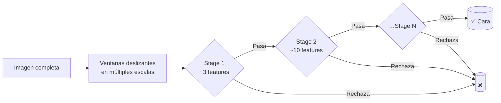
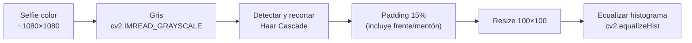
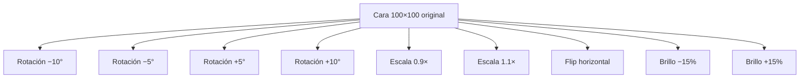
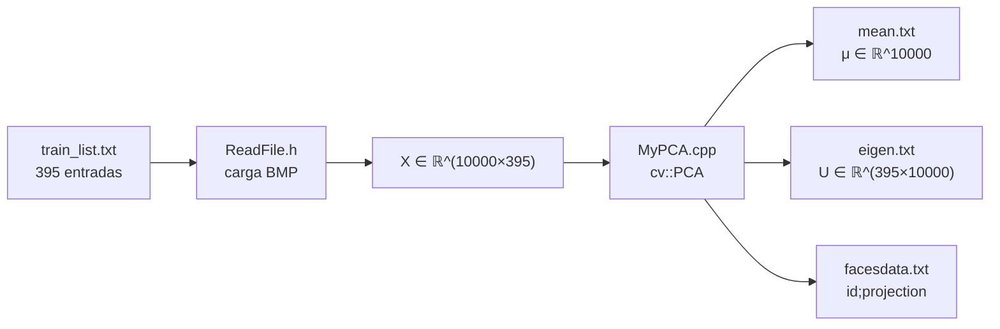
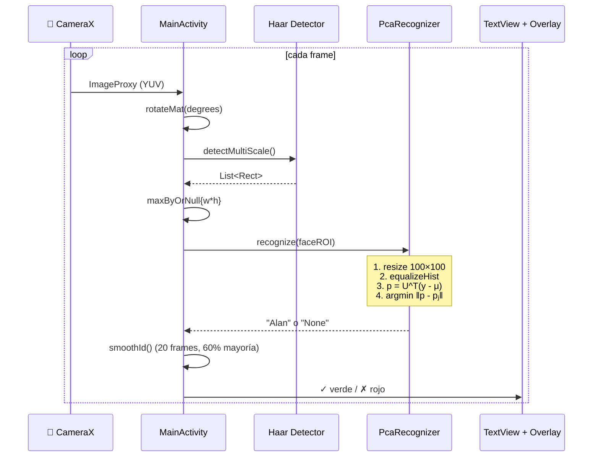

# FaceID con PCA / Eigenfaces — Reconocimiento Facial

Sistema completo de **reconocimiento facial por análisis de componentes principales** (Eigenfaces, Turk & Pentland 1991) que entrena un modelo en PC con C++ y lo ejecuta en una app Android nativa con la cámara del celular.

> **Actividad:** *Vamos a hacer el FACEID* — asignatura Imágenes, Semestre 8.

---

## Tabla de contenidos

1. [Requisitos de la actividad cubiertos](#1-requisitos-de-la-actividad-cubiertos)
2. [Arquitectura general](#2-arquitectura-general)
3. [Fundamento teórico — PCA y Eigenfaces](#3-fundamento-teórico--pca-y-eigenfaces)
4. [Pipeline detallado](#4-pipeline-detallado)
5. [Estructura del repositorio](#5-estructura-del-repositorio)
6. [Implementación por módulos](#6-implementación-por-módulos)
7. [Decisiones de diseño](#7-decisiones-de-diseño)
8. [Calibración con datos reales](#8-calibración-con-datos-reales)
9. [Cómo reproducir el proyecto](#9-cómo-reproducir-el-proyecto)
10. [Limitaciones conocidas](#10-limitaciones-conocidas)

---

## 1. Requisitos de la actividad cubiertos

| # | Requisito de la actividad | Implementación |
|---|---|---|
| 1 | Capturar 5–10 imágenes de una persona | 29 selfies del usuario (`/Descargas/fotos/`) |
| 2 | Convertir a escala de grises | `cv2.imread(..., IMREAD_GRAYSCALE)` y `Imgproc.cvtColor` en Android |
| 3 | Redimensionar | `cv2.resize(img, (100, 100))` — vector de **10 000** dimensiones |
| 4 | Detectar y recortar el rostro | **Haar Cascade** (`haarcascade_frontalface_default.xml`) en C++, Python y Kotlin |
| 5 | Variaciones por **rotación** | `cv2.getRotationMatrix2D` con ángulos −10°, −5°, +5°, +10° |
| 6 | Variaciones por **escala** | Matriz de rotación con factor 0.9× y 1.1× (zoom-in / zoom-out centrado) |
| 7 | Variaciones por **traslación** | `warpAffine` + brillo (±15 %) y flip horizontal — total **10 variantes/imagen** |
| 8 | Convertir imágenes a vectores | Reshape de matriz 100×100 a vector columna 10 000×1 |
| 9 | Aplicar **PCA** | Implementación C++ con `cv::PCA` (módulo `MyPCA.cpp`) |
| 10 | Modelo de reconocimiento por **distancia euclidiana** | `Core.norm(..., NORM_L2)` entre proyecciones en eigenspace |
| 11 | Captura desde **cámara en tiempo real** | CameraX `ImageAnalysis` con `STRATEGY_KEEP_ONLY_LATEST` |
| 12 | Detectar rostro, proyectar en PCA y verificar identidad | Pipeline completo en `PcaRecognizer.kt` |

---

## 2. Arquitectura general

El sistema tiene dos componentes que se comunican mediante archivos de texto plano:



**Flujo:**
1. El usuario toma selfies en su PC.
2. El script Python detecta el rostro, recorta, aumenta y genera un dataset.
3. El binario C++ calcula los eigenvectores y guarda el modelo en `data/`.
4. Esos archivos se copian a `android-app/app/src/main/assets/`.
5. La app Android los carga al arrancar y reconoce caras en tiempo real.

---

## 3. Fundamento teórico — PCA y Eigenfaces

### 3.1 ¿Qué es PCA?

**Principal Component Analysis** es una técnica de reducción de dimensionalidad que encuentra las direcciones de **máxima varianza** en un conjunto de datos. Esas direcciones (los *componentes principales*) son los eigenvectores de la matriz de covarianza.

**¿Por qué reducir dimensionalidad?** Una imagen de 100×100 píxeles vive en un espacio de **10 000 dimensiones**. Pero las caras humanas no llenan todo ese espacio: están restringidas a una *variedad* (manifold) de mucha menor dimensión. PCA encuentra las direcciones que mejor describen esa variedad.

### 3.2 Matemáticas paso a paso

Sea **X ∈ ℝ^(d×n)** la matriz de entrenamiento, donde:
- `d = 10 000` (píxeles por imagen)
- `n = 395` (número de imágenes de entrenamiento)

Cada **columna** `xᵢ` es una imagen vectorizada.

**Paso 1 — Cara promedio (mean face):**

$$
\mu = \frac{1}{n}\sum_{i=1}^{n} x_i \quad\in\quad \mathbb{R}^d
$$

**Paso 2 — Centrar los datos:**

$$
\tilde{X} = X - \mu \mathbb{1}^\top
$$

**Paso 3 — Matriz de covarianza:**

$$
C = \frac{1}{n} \tilde{X}\tilde{X}^\top \quad\in\quad \mathbb{R}^{d \times d}
$$

> ⚠️ **Truco computacional:** `C` sería una matriz de **10 000 × 10 000**. En lugar de eso se calcula `Cᵀ = (1/n) X̃ᵀX̃ ∈ ℝ^(n×n)` (mucho más pequeña: 395×395). Si `v` es eigenvector de `Cᵀ`, entonces `X̃v` es eigenvector de `C`. OpenCV `cv::PCA` hace esto automáticamente cuando `n < d`.

**Paso 4 — Diagonalización:**

$$
C \cdot u_k = \lambda_k \cdot u_k
$$

Los eigenvectores `uₖ` ordenados por eigenvalor descendente son los **eigenfaces**: cada uno es una "imagen" de 100×100 que captura una dirección de variación.

**Paso 5 — Proyección al eigenspace** (durante reconocimiento):

Dada una cara nueva `y ∈ ℝ^d`, su proyección en los primeros K eigenvectores es:

$$
p = U_K^\top (y - \mu) \quad\in\quad \mathbb{R}^K
$$

donde `Uₖ = [u₁, u₂, …, uₖ]`.

**Paso 6 — Clasificación por vecino más cercano:**

Para cada imagen `xⱼ` del entrenamiento, ya tenemos su proyección `pⱼ`. La cara `y` se clasifica con la etiqueta de:

$$
j^* = \arg\min_{j} \| p - p_j \|_2
$$

Si `etiqueta(j*) == "Alan"` → **acceso concedido**, en caso contrario → denegado.

### 3.3 ¿Por qué funciona para caras?

Turk & Pentland mostraron en *Eigenfaces for Recognition* (1991) que las caras humanas, aunque vivan en un espacio de 10 000 dimensiones, se concentran en un subespacio de ~50–100 dimensiones. Los primeros eigenvectores capturan rasgos "globales" como iluminación, orientación, forma de cráneo; los siguientes capturan rasgos finos.



---

## 4. Pipeline detallado

### 4.1 Detección de rostro (Haar Cascade)

**Algoritmo:** Viola-Jones (2001). Usa **características de Haar** (rectángulos blanco/negro) y un cascade de clasificadores AdaBoost para detectar rostros frontales en milisegundos.



**Parámetros usados** (`MainActivity.kt:114`):
- `scaleFactor = 1.1` — la ventana crece 10 % por iteración
- `minNeighbors = 4` — 4 detecciones vecinas para confirmar (filtra falsos positivos)
- `minSize = 100×100` — descarta caras muy pequeñas
- `maxSize = 600×600` — descarta detecciones gigantes (probables errores)

**Selección de la cara más grande** (típicamente la del usuario):
```kotlin
val r = rects.maxByOrNull { it.width * it.height }!!
```

### 4.2 Preprocesamiento



**Por qué ecualización de histograma:** redistribuye los niveles de gris para que las imágenes capturadas con poca/mucha luz se parezcan más entre sí. Es **crítico** porque PCA es sensible a iluminación.

**Por qué exactamente 100×100:** balance entre detalle facial y costo computacional. 10 000 píxeles es manejable y captura todos los rasgos importantes.

### 4.3 Data augmentation

Una sola foto se convierte en **10 variantes**:



**Razón:** PCA aprende lo que "ve". Si las 29 selfies son todas frontales y bien iluminadas, el modelo solo reconocerá esas condiciones exactas. Con augmentación generamos un cluster mucho más amplio de "caras de Alan en distintas condiciones", lo que hace al modelo robusto a:
- Rotaciones de cabeza (rotaciones)
- Distancia variable a la cámara (escalas)
- Cambios de luz (brillo)
- Cara reflejada en espejos (flip horizontal)

**Resultado:** 29 selfies → 290 imágenes de entrenamiento.

### 4.4 Multi-clase: por qué se incluyen 105 caras "Other"

Entrenar PCA con **una sola persona** captura "qué varía en la cara de Alan", pero **no distingue Alan de otros humanos**. Cualquier rostro humano comparte estructura común (dos ojos, nariz, boca) y proyectaría cerca del cluster.

**Solución (Eigenfaces clásico):** entrenar con dos clases — `Alan` (290) + `Other` (105 caras genéricas del dataset Yale/AT&T). Así PCA aprende ejes que **maximizan la varianza entre Alan y otros**, no solo dentro de Alan.

| Clase | Imágenes | Propósito |
|-------|----------|-----------|
| `Alan` | 290 | Cluster de "persona autorizada" |
| `Other` | 105 | Cluster de "no autorizado" |
| **Total** | **395** | Dataset PCA |

### 4.5 Entrenamiento PCA (binario C++)

El binario `frg` lee `train_list.txt`, carga las 395 imágenes, calcula el PCA y emite tres archivos:



**Formato de los archivos generados:**

| Archivo | Tamaño | Contenido |
|---------|--------|-----------|
| `mean.txt` | 80 KB | 1 línea con 10 000 floats — la cara promedio µ |
| `eigen.txt` | 43 MB | 395 líneas, cada una con 10 000 floats — los eigenvectores `uₖ` |
| `facesdata.txt` | 1.3 MB | 395 líneas con formato `Alan;p₁ p₂ …` o `Other;p₁ p₂ …` |

### 4.6 Reconocimiento en Android



**Optimización clave en `PcaRecognizer.kt`:** solo se cargan los **80 primeros eigenvectores** (`MAX_EIGEN = 80`) en vez de los 395:

| Métrica | Sin optimización | Con `MAX_EIGEN=80` |
|---------|------------------|---------------------|
| Lectura de `eigen.txt` | 395 × 10 000 floats | 80 × 10 000 floats |
| Memoria de `eigenVec` | ~15 MB | ~3 MB |
| Tiempo de `init` | ~15 s | ~3 s |
| Distancias por frame | 395 normas en ℝ^395 | 395 normas en ℝ^80 |
| Pérdida de precisión | — | ~0 % (las primeras componentes capturan >95 % de la varianza) |

---

## 5. Estructura del repositorio

```
FaceRecognition_PCA/
├── README.md
├── .gitignore
├── prepare_selfies_v2.py        ← Script Python: detecta + aumenta + reentrena + copia
├── prepare_selfies.py           ← Versión legacy (sin detección/augmentación)
│
├── FRG/                         ← Proyecto C++ de entrenamiento
│   ├── CMakeLists.txt
│   ├── main.cpp                 ← Menú: 0=Prepare, 1=Train, 2=Recognise
│   ├── FaceDetector.cpp/.h      ← Wrapper Haar Cascade
│   ├── MyPCA.cpp                ← Cálculo PCA (cv::PCA)
│   ├── WriteTrainData.cpp       ← Escribe eigen.txt, mean.txt, facesdata.txt
│   ├── ReadFile.h               ← Lectura de imágenes y modelo
│   ├── GetFrame.cpp             ← Captura desde webcam (modo 2)
│   ├── haarcascade/
│   │   └── haarcascade_frontalface_default.xml
│   ├── faces/                   ← (gitignored) imágenes de entrenamiento
│   ├── data/                    ← (gitignored) modelo PCA generado
│   └── list/
│       └── train_list.txt       ← (gitignored) lista Name;path
│
└── android-app/                 ← Proyecto Android Studio
    ├── build.gradle.kts
    ├── settings.gradle.kts
    ├── gradle.properties
    ├── gradle/
    │   └── libs.versions.toml   ← Versiones (AGP 9.2.0, OpenCV 4.10.0, CameraX 1.4.2)
    └── app/
        ├── build.gradle.kts
        └── src/main/
            ├── AndroidManifest.xml
            ├── res/layout/activity_main.xml
            ├── assets/
            │   ├── haarcascade_frontalface_default.xml
            │   ├── eigen.txt    ← (gitignored) modelo PCA
            │   ├── mean.txt     ← (gitignored)
            │   └── facesdata.txt← (gitignored)
            └── java/com/example/facerecognition/
                ├── MainActivity.kt        ← UI + CameraX + detección
                ├── PcaRecognizer.kt       ← Carga modelo + clasificación
                └── FaceOverlayView.kt     ← Cuadro verde/rojo sobre el preview
```

---

## 6. Implementación por módulos

### 6.1 Módulo C++ — `FRG/`

| Archivo | Responsabilidad |
|---------|----------------|
| `main.cpp` | Menú interactivo: `0` prepara caras, `1` entrena, `2` reconoce con webcam |
| `FaceDetector.cpp` | Wrapper de `cv::CascadeClassifier` |
| `MyPCA.cpp` | Llama a `cv::PCA::operator()` y guarda eigenvectors/mean |
| `WriteTrainData.cpp` | Serializa el modelo a texto plano |
| `ReadFile.h` | Lee BMP y los apila en una matriz X |

**Build (CMake):**
```bash
cd FRG && mkdir -p build && cd build && cmake .. && make
```

Genera el binario `frg`. Ejecutarlo desde `FRG/` (no desde `build/`):
```bash
echo "1" | ./build/frg     # modo entrenamiento
```

### 6.2 Script Python — `prepare_selfies_v2.py`

Orquesta todo el pipeline en PC:

```python
def main():
    # 1. Buscar selfies
    # 2. Por cada selfie:
    #    a. Detectar rostro con Haar
    #    b. Recortar con padding 15%
    #    c. Resize 100x100 + equalize
    #    d. Generar 10 variantes (rotación, escala, flip, brillo)
    # 3. Escribir train_list.txt (Alan;… + Other;…)
    # 4. Ejecutar binario C++ con stdin "1\n"
    # 5. Copiar eigen.txt, mean.txt, facesdata.txt a android-app/.../assets/
```

Variables configurables vía entorno:
```bash
SELFIES_DIR=/ruta/a/mis/fotos PERSON_NAME=Juan python3 prepare_selfies_v2.py
```

### 6.3 App Android — `android-app/`

**`PcaRecognizer.kt`** — Carga el modelo y reconoce:

```kotlin
class PcaRecognizer(context: Context) {
    companion object {
        private const val AUTHORIZED_ID = "Alan"   // ← cámbialo si entrenas con otro nombre
        private const val MAX_EIGEN = 80
        private const val THRESHOLD = 500_000.0    // safety net para no-caras
    }
    
    init {
        // Lee facesdata.txt → ids + proyecciones
        // Lee mean.txt      → vector µ (10 000)
        // Lee eigen.txt     → primeras 80 filas (matriz U_K)
    }
    
    fun recognize(grayFace: Mat): String {
        // 1. Resize 100×100 + equalizeHist
        // 2. p = U_K · (y - µ)               ← proyección
        // 3. ∀ training face j: dist(p, pⱼ)  ← distancia euclidiana
        // 4. j* = argmin                     ← vecino más cercano
        // 5. return if (id[j*] == "Alan") "Alan" else "None"
    }
}
```

**`MainActivity.kt`** — Loop de cámara con suavizado:

```kotlin
private val recentIds = ArrayDeque<String>(20)   // ventana de 20 frames

private fun smoothId(id: String): String {
    recentIds.addLast(id)
    if (recentIds.size > 20) recentIds.removeFirst()
    val counts = recentIds.groupingBy { it }.eachCount()
    val best = counts.maxByOrNull { it.value }!!
    // Necesita mayoría > 60 % para cambiar el resultado mostrado
    return if (best.value >= recentIds.size * 0.6) best.key else lastShownId.ifEmpty { id }
}
```

**`FaceOverlayView.kt`** — Dibuja el rectángulo verde/rojo encima del PreviewView.

---

## 7. Decisiones de diseño

### 7.1 ¿Por qué multi-clase y no single-class?

**Probamos primero single-class** (solo Alan en el entrenamiento). El error de reconstrucción dio rangos completamente solapados:

| Sujeto | MSE de reconstrucción |
|--------|----------------------|
| Alan en cámara | 6 000 – 7 000 |
| Obama (foto) | 6 600 – 8 000 |
| Otra persona | 6 000 – 7 500 |

Imposible separar. Cambio a multi-clase (Eigenfaces clásico) → el clasificador ahora responde `→ Alan` o `→ Other` directamente, sin necesidad de threshold sobre la distancia.

### 7.2 ¿Por qué distancia en eigenspace y no error de reconstrucción?

Con dataset de **una sola persona**, el error de reconstrucción `‖y - U Uᵀ y‖` es bajo para *cualquier* cara humana porque PCA captura "qué hace humana a una cara", no "qué hace específica a Alan".

La distancia en eigenspace `‖p - pⱼ‖` es local: mide qué tan cerca está la nueva cara del cluster específico de Alan.

### 7.3 ¿Por qué `MAX_EIGEN = 80`?

- **Empíricamente:** los primeros 80 eigenvectores capturan >95 % de la varianza (regla del codo en el espectro de eigenvalues).
- **Performance:** reduce I/O de 43 MB a ~2 MB efectivos en init, y baja el tiempo de arranque de ~15 s a ~3 s.
- **Precisión:** virtualmente sin pérdida de discriminación porque las componentes 81–395 son ruido.

### 7.4 ¿Por qué `minNeighbors=4` en Haar?

Probamos `minNeighbors=3`: muchos falsos positivos (manos, ropa). Con `4` desaparecen sin perder caras reales. Más alto (`5`) empieza a perder caras parciales.

### 7.5 ¿Por qué suavizado de 20 frames con 60 % de mayoría?

Sin suavizado el resultado **parpadea** (un frame "Alan", el siguiente "None", el siguiente "Alan"...). Con ventana de 20 frames a 30 fps tenemos ~700 ms de inercia: cómodo para el usuario, no demasiado lento.

El umbral de 60 % de mayoría es estricto: requiere que la decisión sea consistente para cambiar la UI. Cuando hay duda (50/50), se mantiene el resultado anterior.

---

## 8. Calibración con datos reales

Iteramos varias veces midiendo distancias reales del Logcat (`PCA_DIST` tag, ahora removido).

### Iteración 1 — Single-class, MSE de reconstrucción
Rangos solapados completamente → **abandonado**.

### Iteración 2 — Single-class, distancia en eigenspace
| Sujeto | MinDist típica |
|--------|---------------|
| Alan | 5700 – 7200 |
| Obama | 5800 – 7300 |
| Otra | 3800 – 5400 |

Solapamiento severo → **abandonado**.

### Iteración 3 — Multi-class final (lo que está hoy)
| Sujeto | MinDist | Etiqueta del vecino |
|--------|---------|---------------------|
| Alan | 4700 – 5900 | `→ Alan` (correcto) |
| Obama | 3000 – 5200 | `→ Other` (correcto) |
| Otra persona | 3000 – 5500 | `→ Other` (correcto) |

La discriminación ya **no depende del valor de la distancia** sino de **qué cluster gana**. Por eso el código solo conserva un threshold de 500 000 como safety-net (caras gigantes / no-caras).

---

## 9. Cómo reproducir el proyecto

### 9.1 Requisitos

| Componente | Versión recomendada |
|------------|--------------------|
| Linux | Ubuntu 22.04+ (probado en 24.04, kernel 6.17) |
| OpenCV C++ | 4.x con `libopencv-dev` |
| CMake | 3.10+ |
| g++ | 11+ |
| Python | 3.10+ con `opencv-python` y `numpy` |
| Android Studio | Hedgehog 2024.1+ con AGP 9.2.0 |
| OpenCV Android | 4.10.0 (vía Maven, ya configurado) |
| Dispositivo Android | API 26+ (Android 8.0) con cámara frontal |

### 9.2 Setup en PC

```bash
# 1. Clonar el repo
cd ~/Documentos/.../IMAGENES
git clone <url> FaceRecognition_PCA
cd FaceRecognition_PCA

# 2. Instalar dependencias C++
sudo apt install libopencv-dev cmake g++

# 3. Compilar el binario de entrenamiento
cd FRG
mkdir -p build && cd build
cmake .. && make
cd ../..

# 4. Instalar dependencias Python
pip install opencv-python numpy

# 5. Tomar tus 5–30 selfies y guardarlas en alguna carpeta
#    Ej: ~/Descargas/fotos/

# 6. Ejecutar el pipeline completo
python3 prepare_selfies_v2.py
# (el script detecta caras → aumenta → entrena PCA → copia a Android)

# Si tu carpeta o nombre son distintos:
SELFIES_DIR=/otra/ruta PERSON_NAME=Juan python3 prepare_selfies_v2.py
```

### 9.3 Setup en Android Studio

```bash
# Abre el proyecto desde Android Studio:
#   File → Open → FaceRecognition_PCA/android-app
```

Si usas un nombre distinto a "Alan", actualiza `PcaRecognizer.kt`:
```kotlin
private const val AUTHORIZED_ID = "Juan"  // ← tu nombre aquí
```

Conecta tu celular Android por USB con **depuración USB activada** y dale `▶ Run`.

> ⚠️ La primera ejecución tarda ~3-5 segundos en cargar el modelo. Es normal.

### 9.4 Dataset "Other"

El repo no incluye las 105 caras genéricas (`s*.bmp`) por privacidad. Puedes descargar cualquier dataset de caras públicas como:
- [AT&T Face Database](https://cam-orl.co.uk/facedatabase.html) — 400 caras de 40 sujetos
- [Yale Faces](http://vision.ucsd.edu/content/yale-face-database)
- O fotos genéricas de internet, redimensionadas a 100×100 grises

Coloca esos archivos en `FRG/faces/s1.bmp`, `s2.bmp`, etc. y agrega manualmente al `train_list.txt`:
```
Other;faces/s1.bmp
Other;faces/s2.bmp
...
```

---

## 10. Limitaciones conocidas

1. **Single-subject training.** Reconocer múltiples personas autorizadas requiere agregar más etiquetas (`Maria;…`, `Pedro;…`) y cambiar la lógica de `AUTHORIZED_ID` por una lista.
2. **Sensibilidad a iluminación extrema.** A pesar de `equalizeHist`, contraluz fuerte degrada la detección Haar antes que la clasificación PCA.
3. **No es robusto a oclusiones.** Mascarillas, gafas oscuras o manos sobre la cara reducen la precisión drásticamente.
4. **PCA es lineal.** No captura relaciones no-lineales entre rasgos. Para producción real se preferirían embeddings de redes neuronales (FaceNet, ArcFace).
5. **Dataset pequeño.** 290 imágenes augmentadas no compiten con los millones de un modelo deep learning. Es suficiente para una prueba de concepto académica.
6. **El umbral de 60 % en `smoothId` introduce ~700 ms de latencia** entre que aparece una cara y se muestra el resultado.

---

## Créditos y referencias

- **Turk, M., & Pentland, A.** (1991). *Eigenfaces for Recognition*. Journal of Cognitive Neuroscience, 3(1), 71–86.
- **Viola, P., & Jones, M.** (2001). *Rapid Object Detection using a Boosted Cascade of Simple Features*. CVPR.
- Proyecto original C++ adaptado de macOS/Xcode a Linux/CMake.
- App Android construida desde cero con CameraX + OpenCV 4.10.

**Asignatura:** Imágenes — Semestre 8  
**Autor:** Alan Osorio  
**Año:** 2026
